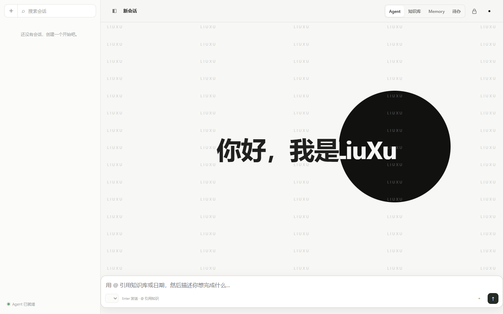

# 留序 LiuXu

**让重要信息留下，让下一步行动有序。**

[](https://github.com/ranr21094-AI/liuxu/releases/latest)
[](https://github.com/ranr21094-AI/liuxu/releases/latest)
[](LICENSE)

留序是一个本地优先的个人 AI 工作台，把 **Agent、知识库、长期记忆和待办** 放在同一个桌面应用里。你的数据库和附件保存在自己的电脑上；需要 AI 时，由你选择并配置模型服务商。

## 下载与安装

### Windows 11 x64

[**前往 GitHub Releases 下载最新安装包**](https://github.com/ranr21094-AI/liuxu/releases/latest)

1. 在最新版本页面下载 `LiuXu-Setup-1.0.0-x64.exe`。
2. 双击安装包，按向导选择程序安装位置。
3. 从桌面或开始菜单打开 **留序 LiuXu**。

安装包目前没有代码签名。Windows 可能显示“未知发布者”；请先核对 Release 页面提供的 SHA-256，再通过“更多信息 → 仍要运行”继续安装。

```powershell
Get-FileHash .\LiuXu-Setup-1.0.0-x64.exe -Algorithm SHA256
```



## 你可以用留序做什么

| 区域 | 用途 |
| --- | --- |
| **Agent** | 与自己选择的模型协作，按确认权限检索知识、维护待办、联网搜索或执行本地工具。 |
| **知识库** | 编写 Markdown 笔记，导入 PDF、DOCX、TXT、Markdown 和图片，按知识库与文件夹整理。 |
| **Memory** | 保存长期事实、习惯和流程；新记忆先以提案形式展示，经你确认后才写入。 |
| **待办** | 管理分类、优先级、重复任务、倒数日和可选的每日邮件提醒。 |

还包括私密知识锁定、Agent 会话归档、JSON/ZIP 备份恢复、模型级能力配置，以及可选的 Chrome 桥接和电脑工具。

## 第一次使用

留序无需注册或登录。打开后可以直接记录笔记和待办；使用 Agent 前，请进入 **设置 → 模型**：

1. 新建一个模型供应商。
2. 填写服务地址、API 格式和你自己的 API Key。
3. 获取或手动添加模型，选择默认模型。

API Key 会使用本机密钥加密保存。调用模型、联网搜索或生图时，相应的提示词、你明确提供的材料或工具结果会发送给所选服务商；这些服务受各自隐私政策约束。

## 数据与隐私

### 数据保存在哪里

Windows 安装版默认使用：

```text
%LOCALAPPDATA%\Work Log Data
```

这里的旧目录名为兼容现有版本而保留。主要内容包括：

| 内容 | 位置 |
| --- | --- |
| 知识、待办、Agent、设置 | `schedule.db` |
| 兼容认证数据库 | `users.db` |
| 笔记图片 | `uploads/` |
| 导入的知识附件 | `knowledge-files/` |
| Agent 生成的文件 | `agent-assets/` |
| 桌面启动日志 | `logs/desktop-main.log` |

模型密钥的本机主密钥单独保存在：

```text
%LOCALAPPDATA%\work-log\ai-secrets.key
```

覆盖安装或卸载留序不会主动删除数据目录。正式清理电脑前，请先在 **设置 → 数据** 导出备份。

### 更换数据目录

目前安装向导可以选择程序位置，但应用内还没有数据目录选择器。请先完全退出留序，再编辑：

```text
%APPDATA%\work-log\desktop-config.json
```

例如：

```json
{
  "version": 1,
  "dataDir": "D:\\LiuXu Data"
}
```

如果原目录已经有数据，请先完整复制到新位置，再修改配置。也可以在启动前设置 `DATA_DIR` 环境变量；其优先级高于配置文件。

### 换一台电脑

1. 在旧电脑正常退出留序。
2. 复制整个 `%LOCALAPPDATA%\Work Log Data`。
3. 同时复制 `%LOCALAPPDATA%\work-log\ai-secrets.key`；缺少它时，已保存的模型 API Key 无法解密，需要重新填写。
4. 在新电脑安装留序，并在首次启动前把上述内容放到对应位置。
5. 如果使用自定义数据目录，在新电脑重新创建 `desktop-config.json`。

ZIP 工作区备份包含数据库和附件，但不会代替 `ai-secrets.key`。密钥文件应单独保管，不要上传到 GitHub 或网盘公开链接。

## 备份与恢复

在 **设置 → 数据** 中可以使用：

- **JSON 备份**：适合导出结构数据，不包含附件。
- **ZIP 工作区**：包含数据库、知识附件、上传图片和 Agent 文件，适合完整迁移。
- **合并恢复**：把备份内容并入当前工作区。
- **替换恢复**：验证通过后替换当前数据；写入前会保存恢复前副本。

恢复期间如果存在活动 Agent 任务，留序会拒绝操作，避免写入冲突。

## 常见问题

### 点击图标没有反应

留序采用单实例启动。再次点击会恢复并聚焦已有窗口。如果仍没有窗口：

1. 在任务管理器确认没有残留的 `LiuXu.exe` 或旧版 `Work Log.exe`。
2. 查看 `%LOCALAPPDATA%\Work Log Data\logs\desktop-main.log`。
3. 检查数据目录是否可写，以及 `.schedule.lock` 中记录的旧进程是否仍在运行。

### Windows 提示未知发布者

`v1.0.0` 安装包未签名，这是当前版本的已知限制。请从本仓库 Release 页面下载并核对 SHA-256，不要使用来源不明的转载包。

### 卸载后数据还在

这是为了防止误删。确认已经备份且不再需要后，才手动删除 `%LOCALAPPDATA%\Work Log Data` 和本机密钥文件。

### Agent 显示未配置

进入 **设置 → 模型** 添加供应商、API Key 和至少一个模型。留序不内置公共模型额度。

## 开发与构建

### 环境要求

- Node.js `^20.19.0`、`^22.12.0` 或 `>=24.0.0`
- Windows 11 x64（桌面安装包）
- 从当前 C 盘项目构建时，脚本使用 `D:\Temp\work-log-build-c` 作为缓存并要求 D 盘至少 5 GB 可用空间

```bash
npm install
npm start
```

打开 `http://127.0.0.1:3000`。开发模式使用项目根目录的 `data/`。

常用命令：

```bash
npm run build          # 生成浏览器 vendor 资源
npm test               # 完整测试
npm run desktop        # Electron 开发模式
npm run desktop:build  # Windows NSIS 安装包
```

构建产物位于 `dist/desktop/`：

```text
LiuXu-Setup-1.0.0-x64.exe
LiuXu-Setup-1.0.0-x64.exe.sha256
desktop-build-summary.json
```

安装包、个人数据库、附件、`.env` 和 `.zcode/` 不会进入 Git。

### 数据目录优先级

桌面安装版按以下顺序选择数据目录：

1. `DATA_DIR` 环境变量。
2. `%APPDATA%\work-log\desktop-config.json` 的 `dataDir`。
3. `%LOCALAPPDATA%\Work Log Data`。

开发服务器默认使用 `./data`。可用 `PORT` 修改端口；默认只监听 `127.0.0.1`。如果把 `HOST` 改为 `0.0.0.0` 或其他非本机地址，服务本身没有账户访问控制，必须自行配置可信网络、HTTPS 和反向代理保护。

### 技术结构

- Electron 主进程启动本机随机端口的 Express 服务，并以沙箱窗口加载。
- SQLite 保存知识、待办、Agent、Memory 和设置，二进制附件保存在数据目录。
- 前端使用原生 JavaScript ES Modules，没有前端框架。
- Markdown 预览使用 marked、DOMPurify、KaTeX 和 PDF.js。
- `better-sqlite3` 原生模块随 Windows x64 安装包分发。

### Chrome 桥接与电脑工具

`chrome-extension/` 是 Manifest V3 扩展，仅允许与 `127.0.0.1` / `localhost` 上的留序通信。电脑工具默认按本地白名单策略启用；写入、命令执行、联网和浏览器操作仍按工具风险请求确认，也可以在设置中关闭。

## 文档

- [更新日志](ChangeLog.md)
- [代码审查与修复记录](code-review-remediation.md)
- [v1.0.0 发布说明](docs/releases/v1.0.0.md)
- [贡献与仓库说明](AGENTS.md)

## 许可证

[MIT](LICENSE) © 2026 ranr21094-AI
