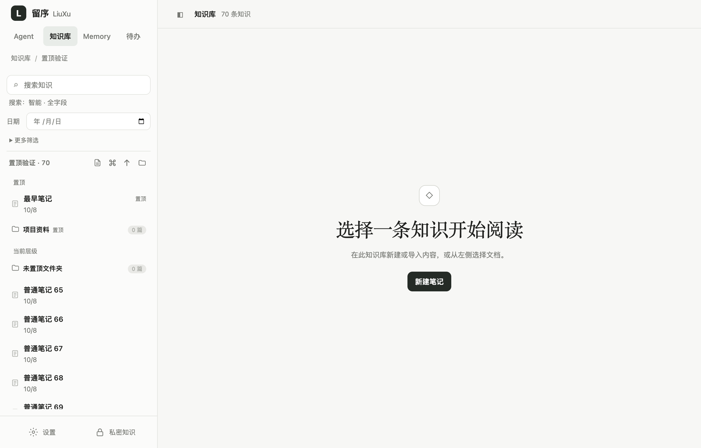
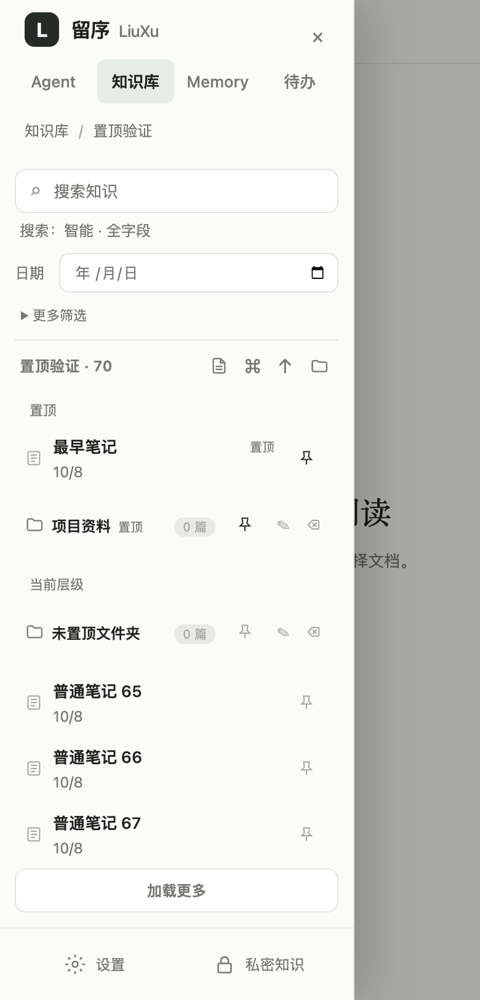

# 知识库按层级置顶

知识库、文件夹、笔记和档案均支持置顶。桌面将鼠标移到项目上，或用键盘聚焦该行后点击图钉；手机打开侧栏后直接点击图钉。再次点击取消。置顶只改变列表顺序，不打开项目，也不改变正文。

## 各层规则

首页置顶知识库。进入任意目录后，置顶区统一展示该目录直属的文件夹和文档，新置顶的项目在前。未置顶的项目保持文件夹优先及既有排序。子目录的置顶不会显示到上层。

搜索、全库筛选和归档列表保持原有排序，不额外提升置顶项。文档在分页前排序，已置顶的旧笔记不会因超过第一页而遗漏；加载更多保留置顶区并继续追加文档。

应用内改名保留置顶。文档移到其他目录、删除或归档后取消其置顶，恢复归档后默认未置顶。移动文件夹时取消该文件夹自身的置顶，但保留内部子文件夹和文档各层的置顶。外部同步识别出文档位置变化时也取消置顶；不把旧目录路径的状态套到外部新增目录。

置顶共享于当前工作区，电脑和手机刷新列表后看到相同状态。置顶不会修改正文版本、更新时间、历史、Markdown 或本地文件名。写入失败保持原显示并提示错误；若文档已被移走，旧目录发出的置顶请求返回位置失效。

## 存储与接口

目录节点和知识文档的 SQLite JSON 记录增加可选 `pinnedAt`；旧数据缺省未置顶，不新增表。历史快照不含此字段。目录规范化及备份恢复保留有效时间。

`PUT /api/knowledge/pin`：

```json
{"kind":"document","id":"note:12","collectionPath":"项目/资料","pinned":true}
```

目录使用 `kind: knowledgeBase|folder` 和 `path`，如 `项目` 或 `项目/资料`。文档的 `collectionPath` 为可选的原位置校验，新前端始终传入。响应包含 `kind` 和 `pinnedAt`，文档同时返回 `id`；取消时 `pinnedAt` 为空。服务端生成时间，重复置顶保持原时间，重复取消无副作用。不存在返回 404，锁定日记或不支持项目返回 403，位置失效返回 409，参数无效返回 400。

现有目录树和文档列表返回置顶信息。正常目录浏览在分页前置顶排序，其他查询保持原规则。前端把当前层文件夹与已加载文档合并成统一置顶区，排序模块独立于正文编辑器。

JSON 备份仍为结构备份，不包含笔记正文；新增可选 `knowledgePins` 保存文档身份、位置和置顶状态，仅对当前数据库中身份及位置均匹配的文档应用，避免复用 ID 时误关联。旧 JSON 不修改文档置顶。ZIP 通过原有 SQLite 保存完整信息。合并恢复保留已有置顶，并接收时间更新的置顶；备份中的未置顶不会取消本地置顶。

## 验证记录（2026-10-08）

- 置顶、同步和工作区备份模块回归：29 项全部通过。
- 完整 `npm test`：497 项，496 通过、1 跳过、0 失败；跳过项为既有 Windows 路径大小写测试。
- `npm run test:knowledge-pins:electron`：macOS Apple Silicon、Electron 43.4.1、隔离数据验证首页、多个层级、文件夹与文档混排、原生按钮点击、分页、重新加载、失败保留排序、搜索与 390px 手机侧栏。
- 单元和接口覆盖笔记、导图、档案、空目录、移动与改名、归档恢复、日记权限、重复请求、跨目录失效、外部同步、JSON/ZIP 恢复、合并及文档身份冲突。

Windows 和真实手机尚未实测；触屏使用 PointerEvent 模拟。未修改真实知识库。版本保持 1.4.6，本轮只交付源码，不打包发布。




