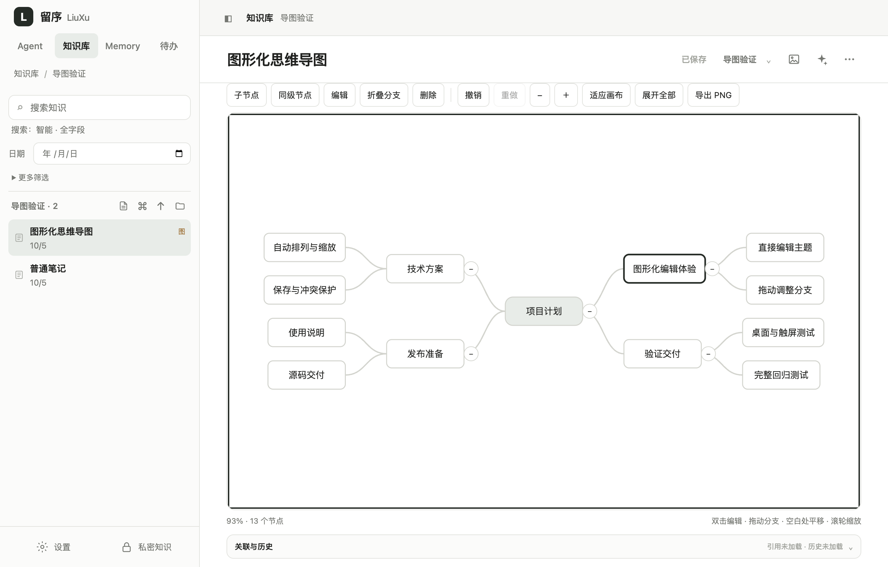
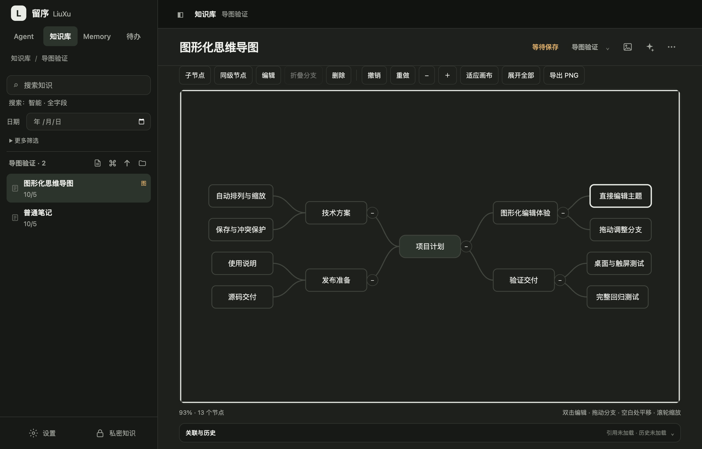
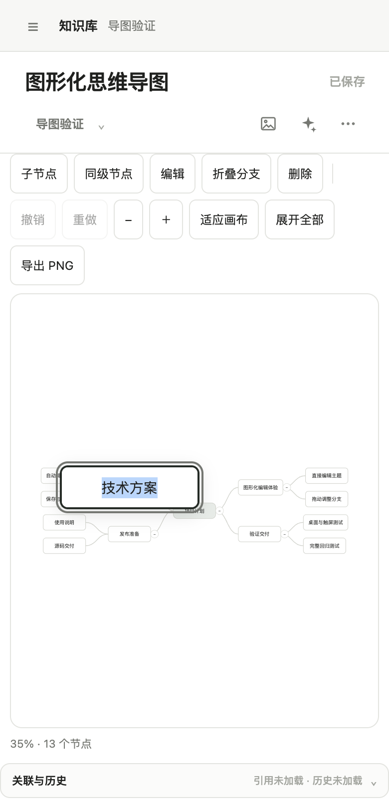

# 图形化思维导图

在知识库新建菜单中选择“思维导图”。中心主题左右自动排列；双击节点直接输入文字，手机上先选中节点，再点“编辑”。文字会自动换行。

## 基础操作

| 操作 | 鼠标 / 触屏 | 键盘（画布获得焦点时） |
| --- | --- | --- |
| 添加子节点 | 选中节点，点“子节点” | Tab |
| 添加同级节点 | 选中分支，点“同级节点” | Enter |
| 编辑节点 | 双击；触屏点“编辑” | F2 |
| 完成文字输入 | 点画布，或完成输入 | Enter；Shift+Enter 换行 |
| 取消文字输入 | — | Escape |
| 删除分支 | 点“删除”；有后代时确认 | Delete / Backspace |
| 撤销 / 重做 | 工具栏 | ⌘/Ctrl+Z；⌘/Ctrl+Shift+Z |

拖动节点可将整个分支挂到另一个节点下面。靠近目标节点上、下边缘，可调整同级顺序；拖到中心主题两侧的空白区，可调整左右方向。虚线边框或插入线显示落点，拖出画布不执行移动。中心主题不能删除或重新挂接，分支不能拖入自身后代。

点击分支旁的圆形按钮折叠或展开，折叠时显示隐藏节点数。空白处拖动平移，滚轮或工具栏缩放，“适应画布”显示全图。触屏用双指缩放和平移，长按节点约 0.4 秒后拖动分支。

“导出 PNG”包含完整展开后的节点、文字和连线，不改变当前折叠状态。超大导图会按画布预算降低导出分辨率，仍保留完整范围。

## 保存与兼容

节点文字、结构和折叠自动保存，沿用笔记的版本检查、本地文件指纹及冲突草稿保护。输入中的文字也进入草稿；切换笔记前提交输入并等待保存。保存失败保留输入，冲突时停止继续图形编辑，先处理冲突。选择、平移与缩放不触发保存。

撤销记录仅属于当前打开的导图，最多 100 步；重新打开文档后重新开始。归档、日记锁定和助手写入期间禁止图形修改。

旧树状导图保留节点 ID 和文字并自动排列。旧数据存在循环、多父节点或孤立节点时按原坐标只读展示并说明原因，不删节点，不自动覆盖。每张导图仍最多 500 个节点。

## 架构

前端保持原生 JavaScript 和 SVG，分为四个模块：

- `mindmap-model.js`：树检查、节点增删、分支移动和同级顺序。
- `mindmap-layout.js`：文字换行、左右树布局、可见范围及完整展开布局。
- `mindmap-view.js`：SVG 连线、节点、折叠按钮和拖动落点。
- `mindmap.js`：输入层、指针与触屏手势、快捷键、撤销重做、导出及销毁。

文档继续使用 `documentRole: mindmap` 和原保存接口；内容 JSON 保持 `version: 1`。新增可选 `rootId`、节点 `side: left|right` 和 `collapsed: boolean`。`edges` 的顺序决定同级顺序，保存的 `x/y` 为自动布局结果。SQLite、本地 Markdown、历史与备份保留整个 JSON，不新增表或接口。

工作台传入文档绑定的权限检查和保存回调。控制器销毁时移除监听器、输入层、观察器、定时器和手势，避免旧画布写入下一篇笔记。服务端创建与修改检查树结构；旧非树数据允许读取和原样保留。

## 验证记录（2026-10-05）

- 模块回归：`node --test test/mindmap.test.js test/knowledge.test.js test/knowledge-folder-sync.test.js`，55 项全部通过。
- 全量回归：`npm test`，477 项，476 通过、1 跳过、0 失败。
- `npm run test:mindmap:electron`：macOS Apple Silicon、Electron 43.4.1、隔离数据库通过。验证原生双击输入、保存、缩放下拖动重挂、撤销、折叠、完整 PNG 下载、切换文档销毁、再次打开、浅色/深色主题、390px 手机宽度和模拟触屏选择编辑。
- 单元验证覆盖中文输入法、长文字、键盘增删、500 节点布局、循环挂接、触屏长按/双指、取消拖动、过期删除确认、权限锁定、输入草稿、旧图只读及销毁后无回调。
- 存储验证覆盖新字段校验、历史、归档禁止写入、本地文件同步、外部冲突草稿和数据库备份恢复。完整测试同时覆盖既有保存延迟、失败、版本冲突及同步回归。

真实 iOS/Android 触屏、Windows Electron 未在本机实测。本轮保留 1.4.6，仅交付源码，不生成安装包，不修改真实笔记。

