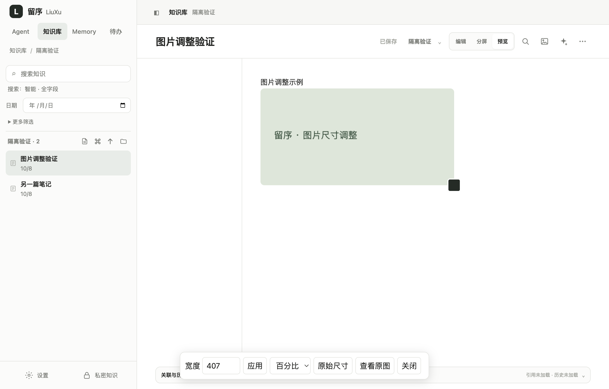
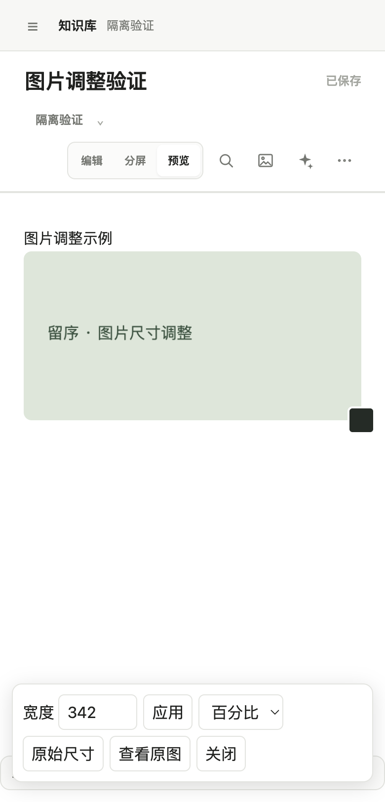

# 笔记图片插入与尺寸调整

新上传或粘贴的图片默认插入为 HTML：

```html


```

本地同步把上传图片复制到 Markdown 所在目录，改写 `src` 为相对路径，保留 HTML 和尺寸。原图片文件不改变，旧笔记不批量转换。

## 使用

在分屏或预览模式中单击图片，右下角出现缩放手柄，底部出现尺寸栏。拖动手柄等比调整，释放后保存；取消指针操作或按 Escape 不保存本次拖动。也可输入 16–10000 像素宽度后点“应用”，或选择 25%、50%、75%、100%。手机可触摸拖动或使用尺寸输入。

“原始尺寸”移除正文中该图片的尺寸设置；正文区域仍限制显示宽度，避免溢出。“查看原图”沿用已有图片查看器，双击原图查看的操作继续可用。

同一图片多次引用可以分别调整；首次调整旧的直接 Markdown 图片引用时，仅将该引用转换成 HTML。无法安全对应到源码的复杂图片语法保留原显示和双击查看，不冒险改写其他图片。

修改尺寸走现有自动保存、版本检查和冲突草稿流程；失败不丢正文，冲突停止调整。归档、日记锁定或助手正在写入时不可调整。上传期间切换笔记或改变正文，不将上传结果插入另一篇笔记；可能保留已上传但未引用的文件，不自动清理。

## 实现

`public/js/knowledge/note-images.js` 提供安全属性转义、源码图片范围识别、尺寸改写和预览调整控制器。预览图片按出现顺序对应源码范围，操作绑定文档、版本与完整正文；校验失效则停止写入。拖动仅临时改变视觉宽度，结束时才更新正文；切换文档、重新预览和退出预览释放控件及监听器。

相对 HTML 图片通过已有受权限保护的资源接口加载，尺寸处理限定在笔记预览，不改变 Agent、笔记助手或档案阅读器的排版。HTML 仍经过现有清洗和图片地址检查；代码示例不改写。同步迁移只替换 HTML 的真实 `src` 属性，不再转成 Markdown，移动后保留尺寸与图片依赖。

不增加接口或数据库字段；HTML 随现有正文保存、历史和备份传递。版本保持 1.4.6，本轮不打包、不发布，不修改真实笔记。

## 验证（2026-10-08）

- 图片、同步、链接与图片去重模块：26 项通过。
- 完整 `npm test`：483 项，482 通过、1 跳过、0 失败。跳过项为既有 Windows 路径大小写测试。
- `npm run test:note-images:electron`：macOS Apple Silicon、Electron 43.4.1、隔离数据通过。验证真实上传、HTML 正文、图片预览、像素与百分比保存、原生鼠标拖动、取消、390px 手机宽度、清理和延迟上传切换笔记。
- 单元及存储回归覆盖属性转义、重复引用、代码示例、非法尺寸、文档/版本/正文失效、权限锁定、取消指针、监听器清理、本地同步、跨目录移动与命名历史恢复。
- Windows 和真实 iOS/Android 尚未实测；触摸路径通过 PointerEvent 模拟验证。




